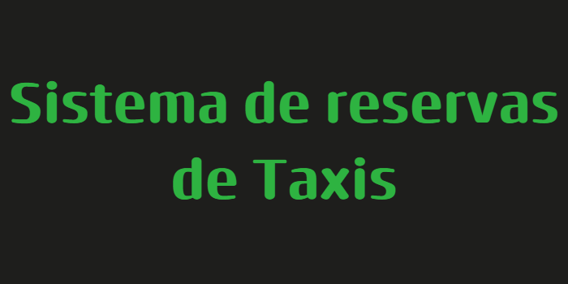

# taxisApp



## Versión
1.0.0

## Descripción
Un proyecto CRUD usando Node.js, Express y Sequelize con una estructura basada en el Modelo-Vista-Controlador.

## Requisitos previos
- Debes tener [Node.js](https://nodejs.org/) instalado en tu sistema.

## Instalación

### 1. Crear y acceder al directorio del proyecto
```bash
mkdir taxisApp
cd taxisApp
npm init -y

2. Instalar las dependencias

Dependencias de producción
npm install cors express mysql2 sequelize supertest

Dependencias de desarrollo
npm install --save-dev nodemon


3. Configuración del archivo package.json
Añade o actualiza las secciones scripts y type:

{
  "type": "module",
  "scripts": {
    "dev": "nodemon app.js"
  }
}


4. Archivos de inicio
index.js: Punto de entrada principal.
app.js: Configuración de Express.
5. Configuración de Sequelize (opcional)
Si usas Sequelize con MySQL, configura según las necesidades. Consulta la documentación oficial de Sequelize para más detalles.

6. Configuración de Nodemon (opcional)
Si necesitas personalizar Nodemon, crea un archivo nodemon.json en la raíz.


Uso
Iniciar en modo desarrollo:

npm run dev


Dependencias
Producción
cors: ^2.8.5
express: ^4.18.2
mysql2: ^3.6.1
sequelize: ^6.33.0
supertest: ^6.3.3
Desarrollo
nodemon: ^3.0.1
